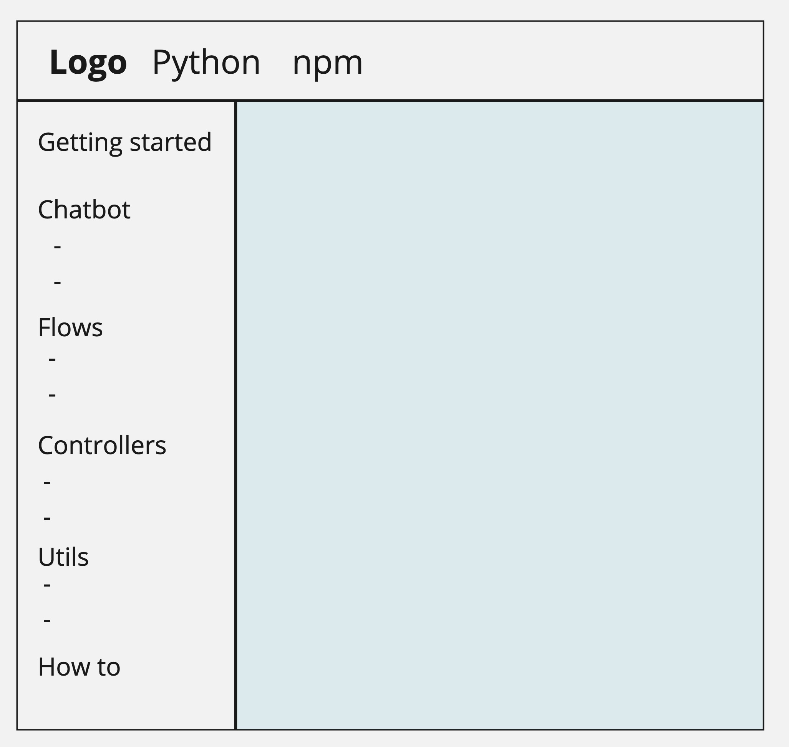

# Intellinode docs

## Setup
Start the project:
```
cd intellidocs
npm install
npm start
```

Open `http://localhost:3000`

## Content
### Mockup



## Pages
Check the inner pages structure [here](https://docs.google.com/document/d/1f5F_suOwuOZ8ZR3yBydxVP6kR0i1hj-I9GoWnIEK-jM/edit?usp=sharing).
