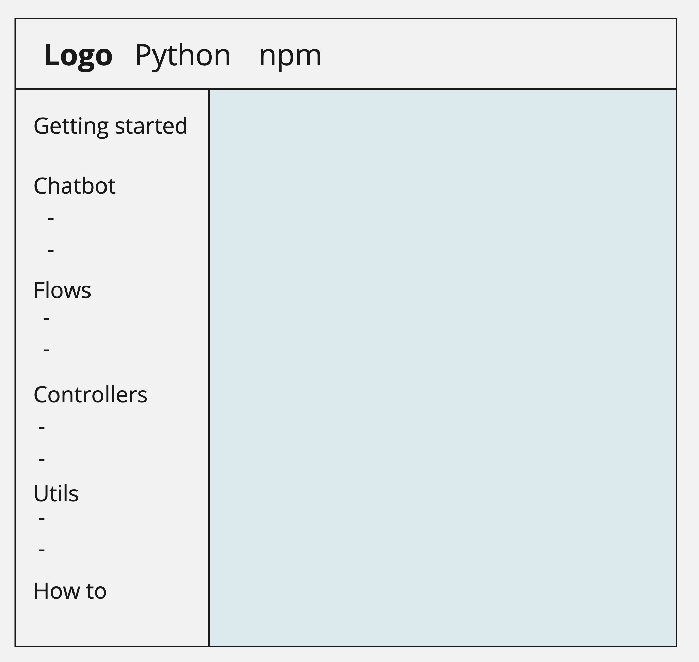

# Intellinode docs

## Setup
Start the project:
```
cd intellidocs
```
- NPM:
```
npm install
npm start
```
- Yarn:
```
yarn
yarn start
```

Open `http://localhost:3000`

## Publishing and search indexing (IndexNow)
The site deploys automatically after a push to `main`. After every publish that adds or changes pages (articles, docs, use cases), submit those pages to IndexNow so Bing, Yandex, Naver, Seznam and Yep crawl them quickly.

1. Push to `main` and wait until the deploy is live (the new page opens on https://www.intellinode.ai).
2. From `intellidocs`, submit only the pages that are new or changed:
```
npm run indexnow -- /articles/new-article-slug /docs/python/flows/get-started
```
3. Check the output. `200` means accepted and `202` means received while the key is validated; both are fine. `403` or `422` means the key file or the URLs are wrong, and `429` means too many requests, so wait before trying again.

Other options:
- `npm run indexnow -- --dry-run` lists the URLs without sending them.
- `npm run indexnow` with no paths sends every URL in the live sitemap. Use it only after a large change, such as a new section or a site-wide URL change, because repeating unchanged URLs can get submissions rate-limited.

How it works: the key file `intellidocs/static/bd34eaec1ac75ea7e9dec3485c744d33.txt` is served at the site root and proves the submissions come from the site owner. Keep that file in place, do not rename it, and do not create a second key. The script lives in `intellidocs/scripts/indexnow.mjs` and refuses to send anything until the key file is live.

The site also publishes https://www.intellinode.ai/llms.txt, an index of every docs page and article for coding agents such as Claude Code, Codex and Cursor. It is generated on every build by `intellidocs/src/plugins/llms-txt.js` from the sidebars and the articles folder, so there is nothing to update by hand.

The folder `intellidocs/static/agent-kit` holds the files that connect Intelli to coding agents: an `AGENTS.md` section, a `SKILL.md` and the example code from the Claude Code and Codex article. They are served as plain files under https://www.intellinode.ai/agent-kit/ and linked from llms.txt. When the Intelli API changes, update them and rerun the examples.

Google does not use IndexNow. For Google, the sitemap `https://www.intellinode.ai/sitemap.xml` is submitted in Google Search Console.

## Content
### Mockup



## Pages
Check the inner pages structure [here](https://docs.google.com/document/d/1f5F_suOwuOZ8ZR3yBydxVP6kR0i1hj-I9GoWnIEK-jM/edit?usp=sharing).
