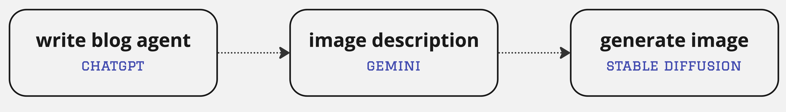

# Sequence flow

Sequence flow enables the execution of tasks in a sequential order. This is useful when tasks have dependencies that require them to be executed one after another to pass the output of previous step as input to the current step.

### Example
Let's build a content creation pipeline to show the capability of the `SequenceFlow`. The flow will include three tasks: writing a blog post about electric cars, generating a short image description for the blog, and finally, creating a cartoon-style image from the description.




#### Agents
Let's define an intelli agent for each step, each of the agents will interface different model provider.

```python
from intelli.flow.agents.agent import Agent

blog_agent = Agent(agent_type='text', provider='openai', mission='write blog posts', model_params={'key': YOUR_OPENAI_API_KEY, 'model': 'gpt-4'})
copy_agent = Agent(agent_type='text', provider='gemini', mission='generate description', model_params={'key': YOUR_GEMINI_API_KEY, 'model': 'gemini'})
artist_agent = Agent(agent_type='image', provider='stability', mission='generate image', model_params={'key': YOUR_STABILITY_API_KEY})
```

#### Tasks
A task is an action or operation in the workflow. We are going to use a text_head processor between the blog post and the image description step. This pre-processor used to pass only the first n characters to the next step, as the image description require high level idea about intro instead of the full text. You can build your cuatom processor, check the details in the related page.
```python
from intelli.flow.tasks.task import Task
from intelli.flow.input.task_input import TextTaskInput
from intelli.flow.processors.basic_processor import TextProcessor

task1 = Task(TextTaskInput('blog post about electric cars'), blog_agent, log=True)
task2 = Task(TextTaskInput('Generate a short image description for the blog post'), copy_agent, pre_process=TextProcessor.text_head, log=True)
task3 = Task(TextTaskInput('Generate a cartoon style image relevant to the blog post'), artist_agent, log=True)
```

#### Sequence Flow

The Sequence flow orchestrates the execution of the tasks in the defined order.

```python
from intelli.flow.sequence_flow import SequenceFlow

# start sequence flow
flow = SequenceFlow([task1, task2, task3], log=True)
final_result = flow.start()
```

Check the next section for flexible graph-based flow.
